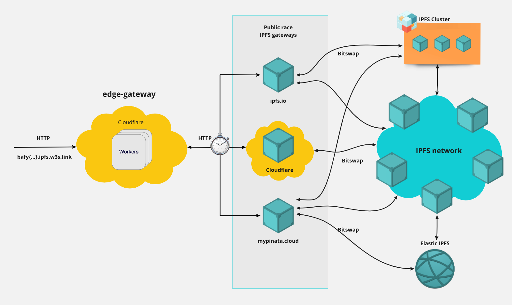
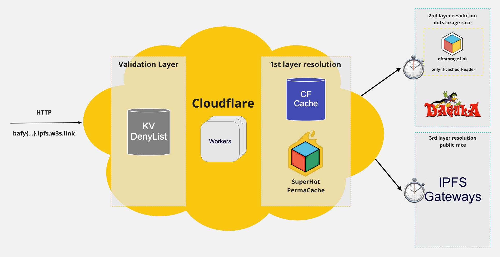

# edge gateway link for Web3.storage - w3s.link

> The IPFS edge gateway for web3.storage is not "another gateway", but an edge layer sitting on top of existing IPFS public gateways with augmented caching capabilities.

## Getting started

- `pnpm install` - Install the project dependencies from the monorepo root directory.
- `pnpm dev` - Run the worker in dev mode.

## Environment setup

- Add secrets

  ```sh
    wrangler secret put SENTRY_DSN --env $(whoami) # Get from Sentry
    wrangler secret put LOKI_URL --env $(whoami) # Get from Loki
    wrangler secret put LOKI_TOKEN --env $(whoami) # Get from Loki
  ```

- `pnpm run publish` - Publish the worker under desired env. An alias for `wrangler publish --env $(whoami)`

## High level architecture

`w3s.link` is serverless code running across the globe to provide exceptional performance, reliability, and scale. It is powered by Cloudflare workers running as close as possible to end users.

Thanks to IPFS immutable nature, a CDN cache is an excellent fit for content retrieval as a given request URL will always return the same response. Accordingly, as a first IPFS resolution layer, `w3s.link` leverages Cloudflare [Cache API](https://developers.cloudflare.com/workers/runtime-apis/cache) to look up for content previously cached in Cloudflare CDN (based on geolocation of the end user), as well as our SuperHot premium feature with perma-cache.

If the content is not in the first caching layers, we will trigger a dotstorage resolution where other dotstorage products cache is checked.

In the event of content not being already cached, a race with multiple IPFS gateways is performed. As soon as one gateway successfully responds, its response is forwarded to the user and added to Cloudflare Cache.



Zooming in on the actual edge gateway:



Notes:

- Cloudflare Cache is [limited](https://developers.cloudflare.com/workers/platform/limits/#cache-api-limits) to 512 MB size objects.
- SUperHot perma-cache is shared with nftstorage.link

## Usage

Get your files from the IPFS Network via their unique content identifier with a lightning fast experience. Like any other IPFS gateway, `w3s.link` supports IPFS path style resolutions `https://w3s.link/ipfs/{cid}` and subdomain style resolution `https://{CID}.ipfs.w3s.link/{optional path to resource}`

```
> curl https://w3s.link/ipfs/bafkreig5ry6hjrkj2xyut5yrdjztap2z2yso6qlq4n7rnalt5l4lsccw2u
Hello web3.storage! 😎

> curl https://bafkreig5ry6hjrkj2xyut5yrdjztap2z2yso6qlq4n7rnalt5l4lsccw2u.ipfs.w3s.link
Hello web3.storage! 😎
```

In practice, when the Gateway receives a IPFS path style request, it will redirect to a subdomain style resolution maintaining compliance with the [same-origin policy](https://en.wikipedia.org/wiki/Same-origin_policy). The canonical form of access `https://{CID}.ipfs.w3s.link/{optional path to resource}` causes the browser to interpret each returned file as being from a different origin.

Please note that subdomain resolution is only supported with [CIDv1](https://docs.ipfs.io/concepts/content-addressing/#identifier-formats) in case-insensitive encoding such as Base32 or Base36. When using IPFS path resolution, the requested CID will be converted before the redirect.

### Rate limiting

w3link is currently rate limited at 200 requests per minute to a given IP Address. In the event of a rate limit, the IP will be blocked for 30 seconds.

## Deny List

We rely on [badbits](https://github.com/protocol/badbits.dwebops.pub) denylist together wtth our own denylist to prevent serving malicious content to the nftstorage.link users.

When new malicious content is discovered, it should be reported to [badbits](https://github.com/protocol/badbits.dwebops.pub) denylist given it is shared among multiple gateways.

## Contributing

Feel free to join in. All welcome. [Open an issue](https://github.com/web3-storage/w3link/issues)!

If you're opening a pull request, please see the [guidelines in DEVELOPMENT.md](https://github.com/web3-storage/w3link/blob/main/DEVELOPMENT.md#how-should-i-write-my-commits) on structuring your commit messages so that your PR will be compatible with our [release process](https://github.com/web3-storage/w3link/blob/main/DEVELOPMENT.md#release).

## License

Dual-licensed under [MIT + Apache 2.0](https://github.com/web3-storage/w3link/blob/main/LICENSE.md)
